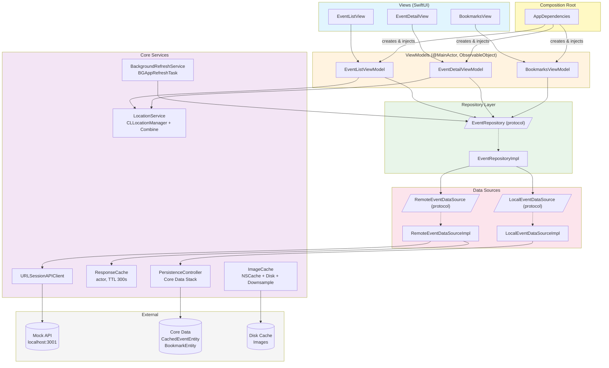

# Architecture Diagram



## Data Flow

```mermaid
graph LR
    API_JSON["API JSON"] -->|decode| DTO["EventDTO<br/>(Codable)"]
    DTO -->|map in Repository| DM["Event<br/>(Domain Model)"]
    DM -->|@Published| VM["ViewModel<br/>(ViewState)"]
    VM -->|binding| V["SwiftUI View"]

    CD_Entity["Core Data Entity"] -->|map in DataSource| DM

    style DTO fill:#fce4ec
    style DM fill:#e8f5e9
    style VM fill:#fff3e0
    style V fill:#e1f5fe
    style CD_Entity fill:#f5f5f5
```
