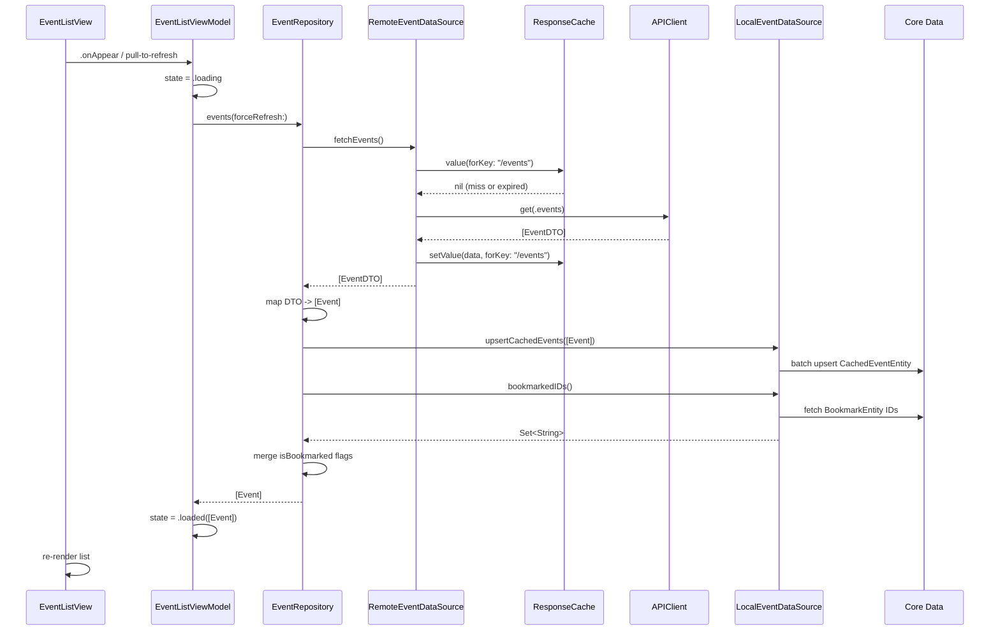
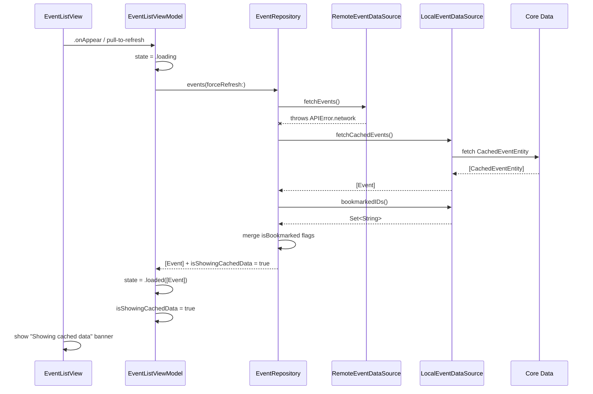
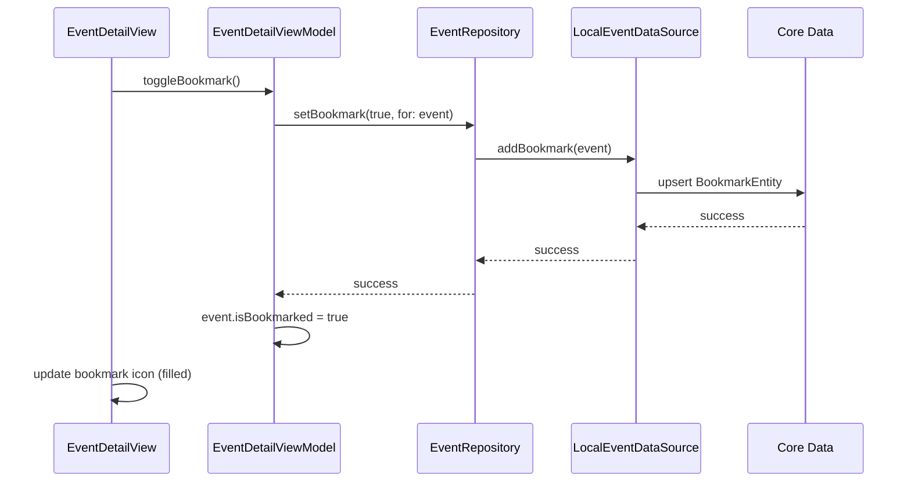
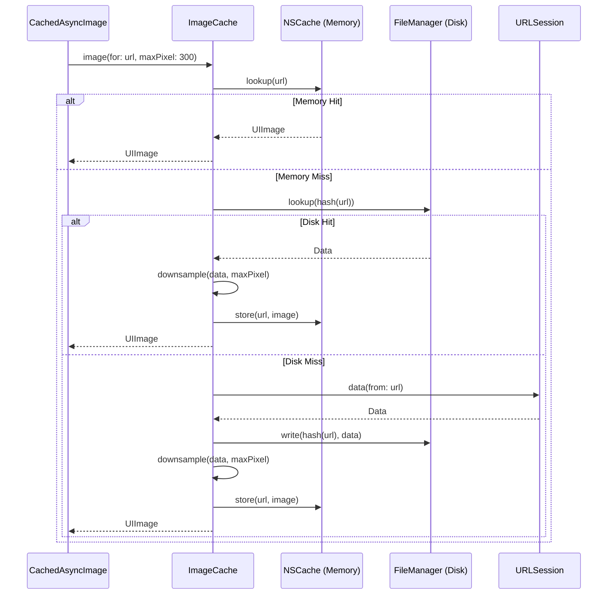
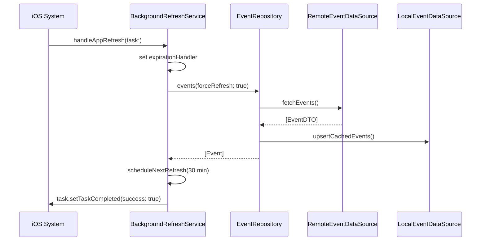

# Sequence Diagrams

## 1. Event List Load (Online - Happy Path)

## 2. Event List Load (Offline - Cache Fallback)

## 3. Bookmark Toggle

## 4. Image Loading (CachedAsyncImage)

## 5. Background Refresh

